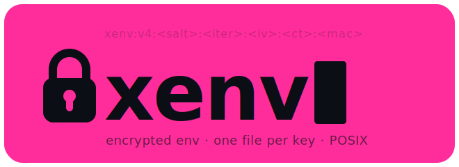

<p align="center">
  
</p>

# xenv

## NAME

xenv — a git-backed secrets vault: encrypted environment variables you commit straight into your repo

## WHY

Your secrets are one `git add .` from a public repo. Every fix — a KMS, a CI secrets panel, a `.env` in `.gitignore`, a pre-commit hook — puts an easy path (paste it in a file) next to the secure path, and humans take the easy one. Some [actively disable the guardrails](#rationale) first.

xenv removes the choice. There is no plaintext on disk to commit. Each variable is a separate AES-256 file that lives *in* your repo — safe to push, useless without the passphrase, which never touches the tree.

```sh
xenv set @production STRIPE_KEY=sk_live_...    # → one encrypted file, safe to commit
xenv @production ./deploy                       # decrypt at exec-time; nothing hits disk
xenv @production --json | jq -r .DATABASE_URL   # load into any language
xenv @production --dotenv > .env                # or dump a plaintext cache, then go
```

Because the ciphertext lives in the repo and the passphrase doesn't, the whole secret lifecycle rides **normal git**: change a value → commit → PR → review the diff → merge. GitHub's repo permissions *are* your access control — no server, no SaaS, no separate secrets system to stand up. It's a git-backed vault you adopt incrementally: devs and CI dump the env and get on with their day (`--dotenv`, `--json`, or exec-time), and PRs manage secrets the way they already manage code.

It's a single POSIX shell script over `openssl(1)` — no daemon, no service, no account, no lock-in. `xenv setup` **vendors** a self-contained copy into `xenv/bin/xenv`, so the tool travels *in* your repo, pinned to the commit that wrote your secrets — no install step, no package to drift. And because it's one small script — the crypto is three ~15-line functions — you can read the whole thing end to end. So can an agent: it fits in context, so an AI can **audit** the tool it's about to trust before running it. The wire format is documented, frozen, and shipped with [conformance vectors](recipes/vectors/), so if the tool ever vanished a 20-line decryptor in any language still opens your data.

**The bet: the format is the product; the tool is disposable.**

- **Commit-safe by construction** — no plaintext on disk, no `.gitignore` to forget, no easy/secure split.
- **Managed by git** — change a secret with a PR; GitHub perms are the ACL; rotation (`xenv key rotate`), not deletion, is how you revoke (history keeps old ciphertext).
- **Vendored & auditable** — ships *in* the repo (`xenv/bin/xenv`), pinned, no install; small enough that a human or an agent can read and audit the entire tool in one sitting.
- **Just `sh` + `openssl`** — one writer, no runtime service; nine read-only reimplementations (Python/Node/Ruby/Go/Rust/PHP/Java/C#/Elixir), all cross-verified in CI.
- **The format is the spec** — three tiny crypto functions, an offline oracle to prove any implementation, zero vendor to outlive.
- **Agent-ready** — `xenv @env --json` loads an env in any language; an agent can't leak what was never on disk, and can vet the vendored script before trusting it.

```
xenv
├── README.md                       # frontmatter (project id) + docs
├── bin
│   └── xenv                        # self-contained copy of the tool
└── envs
    └── production
        ├── README.md               # frontmatter (KDF params) + docs
        ├── API_KEY.value.enc       # one encrypted variable per file
        ├── DATABASE_URL.value.enc
        └── TLS_CERT.value.enc      # multi-line / binary values ok
```

```sh
xenv setup                           # bootstrap xenv/ with one env ("development")
xenv set API_KEY=sk-…                # single-env repo → no @<env> needed
xenv set TLS_CERT < cert.pem
xenv get API_KEY                     # silent on success — pipeable
xenv ./server                        # exec with the env injected
xenv key rotate                      # new passphrase, re-encrypt all
```

Multiple envs? Name them at setup and address them with `@<env>`:

```sh
xenv setup testing staging production   # a spread — each addressed explicitly
xenv set @production API_KEY=sk-…
xenv @production ./deploy
```

## SYNOPSIS

```
xenv setup [<env>...]                  # bootstrap (one env, or the named spread) / adopt
xenv environments                      # list envs

xenv key generate @<env> [--keychain | --pass | --file]
xenv key set      @<env> [--keychain | --pass | --file]   # passphrase on stdin/tty
xenv key rotate   @<env>
xenv key show     @<env> [--reveal]
xenv key forget   @<env>

xenv set    @<env> KEY=value
xenv set    @<env> KEY                  # value on stdin
xenv get    @<env> KEY
xenv unset  @<env> KEY
xenv list   @<env>
xenv edit   @<env> KEY

xenv run    @<env> CMD [args]
xenv @<env>      CMD [args]            # shorthand for run
xenv @<env>                            # no CMD: print KEY=value lines
xenv @<env> --json                     # print the env as one JSON object
xenv @<env> --dotenv                    # print a dotenv-safe .env (fast-load cache)

xenv help | version
```

The `@<env>` token may appear **anywhere** in argv. These are equivalent:

```
xenv get @production API_KEY
xenv @production get API_KEY
xenv get API_KEY @production
```

**You often don't need `@<env>` at all.** When no `@<env>` is in argv, xenv resolves the env by: (1) `$XENV_ENV`, then (2) **the sole env** — if the repo has exactly one, it's the default. So a single-env repo just works, zero config:

```
xenv setup                # one env
xenv get API_KEY          # no @<env> — the only env is implied
xenv ./server
xenv --json
```

Multi-env repos stay explicit on purpose (so a stray command can't hit the wrong one): name `@<env>` or set `$XENV_ENV`. An explicit `@<env>` always wins. Bare `xenv` (no verb) still prints help — dumping an env requires an explicit `@<env>`, so an implicit default never spills secrets on a bare command.

## THE MODEL — one spec, many interfaces

xenv is three things, in order of durability:

1. **The wire format** — the actual core. One line per secret: `xenv:v3:<iv>:<ct>:<mac>` — AES-256-CBC, encrypt-then-MAC, PBKDF2-SHA256-derived keys. Documented as a spec in [`recipes/README.md`](recipes/README.md). Everything conforms to this or it's out.
2. **The reference writer** — this POSIX tool. The one thing that *mutates* a vault: `set`, `edit`, `rotate`, key management. Auditable in an afternoon — ~1000 lines of `sh` around `openssl(1)`.
3. **Read-only loaders** — in any language. At runtime an app only needs to *read* its env, and a loader is ~20 lines of crypto with no write path — so no loader can ever corrupt a vault. One writer, many readers.

The proof that they interoperate isn't trust — it's [`recipes/vectors/`](recipes/vectors/): a self-contained oracle (`vectors.json` plus reference verifiers) that any implementation checks itself against with **no tool, no vault, and no network**. Port the ~20-line decrypt path, run it against the vectors; green means your loader speaks xenv, forever. Today there are native loaders in nine languages (Python, Node, Ruby, Go, Rust, PHP, Java, C#, Elixir), all cross-verified in CI.

## FOR AI AGENTS

An agent working in a repo can treat xenv as a black box with a JSON seam:

- **Detect:** an `xenv/` directory means secrets are managed here.
- **Load:** `xenv @<env> --json` → one JSON object, parseable by any stdlib. Never read `.value.enc` files directly.
- **Passphrase:** comes from the environment (`$XENV_KEY_<ENV>` / `$XENV_KEY`) — an agent never needs, and should never seek, a key on disk.
- **Never write secrets from application code.** Writing belongs to the tool / CI / a human. Loaders are read-only on purpose.
- **Verify offline:** the [vectors](recipes/vectors/) are the conformance oracle — generate a loader, prove it correct, no human in the loop.

## ROADMAP

Where this is heading (tracked in [issues](https://github.com/ahoward/xenv/issues)); the north star is that an agent, given only the spec and the vectors, can load an env — or generate a correct loader and *prove* it — with no human in the loop:

- **Self-contained v4 envelope** (#12) — salt + iterations embedded per value, so a single `.value.enc` decrypts in isolation, no sibling README required. The ultimate "recover one secret, decades later, in any language" primitive.
- **Read-only loaders as the default** (#16, #17) — recipes become pure readers; the conformance gate becomes *the tool writes → every loader reads it back byte-exact and rejects tampering.*
- **Provision-on-demand + `xenv loader <lang>`** (#20–#24) — resolve or fetch the core by convention (pinned + checksummed, never silent); the tool emits its own read-only loaders; a `version --json` capability probe for agents.
- **Portability** (#25) — close the stock-macOS/LibreSSL gap so the writer runs everywhere the readers already do.

## DESCRIPTION

xenv stores encrypted environment variables in a project's repository. Each variable lives in its own `<KEY>.value.enc` file as a single line of the form `xenv:v3:<iv-hex>:<ct-hex>:<mac-hex>`. Per-env KDF parameters (`version`, `iter`, `salt`) live in YAML frontmatter at the top of a sibling `README.md`. The passphrase paired with those parameters lives outside the repo — in an environment variable, a mode-600 file under `~/.config/xenv/`, the macOS keychain, or `pass(1)`.

Every file in `xenv/` is safe to commit by design. The encryption key is the only thing that must not be committed; the design makes it impossible to put it there by accident.

xenv is a POSIX shell script. It depends on `sh`, `openssl(1)` **3.0+**, `awk`, `mktemp`, and `od`. The one real catch: it uses `openssl kdf`, which LibreSSL lacks — so on stock macOS you need a real OpenSSL 3 (`brew install openssl`), not the system default. After `xenv setup`, the script copies itself into `xenv/bin/xenv` inside the project — clone on a new machine, put `myproject/xenv/bin` on `$PATH`, no re-install needed.

## COMMANDS

`setup [<env>...]`
> Bootstrap or adopt. If `./xenv/` doesn't exist: create it with the named envs — or, with no names, **one env called `development`** (so a single-env repo needs no `@<env>`). `xenv setup production` makes one `production` env; `xenv setup testing staging production` makes a spread. Writes the project id into `xenv/README.md` and generates ONE random project-wide passphrase (`_global.key`) that the envs share via the cascade. `$XENV_KEY` is honored as the global if set; `$XENV_KEY_<ENV>` is honored as a per-env override (writes `<env>.key`). If `./xenv/` already exists (e.g. you cloned a teammate's repo): walk each env, prompt for the passphrase (or honor `$XENV_KEY_<ENV>` / `$XENV_KEY`), decrypt one value to MAC-verify, cache to `~/.config/xenv/projects/<id>/keys/<env>.key` on success. Non-tty stdin without env vars set: skip with a warning.

`environments`
> List envs and which have a known passphrase locally.

`key generate [@<env>] [--keychain | --pass | --file]`
> With `@<env>`: create a new env directory and generate a fresh random per-env passphrase. With no `@<env>`: generate a random project-wide passphrase (`_global.key`); every env without its own per-env key cascades to this one. Backend flag selects local storage (default: file).

`key set [@<env>] [--keychain | --pass | --file] [--force]`
> Read a passphrase from stdin (or tty no-echo prompt). With `@<env>`: MAC-verify against that env's existing values; refuse to cache on mismatch unless `--force`. With no `@<env>`: MAC-verify against every env that currently cascades to the global; refuse if any fail. Use this to pin a passphrase against an existing vault, or to re-cache after `key forget`.

`key rotate [@<env>]`
> With `@<env>`: generate a new per-env passphrase, re-encrypt every value in that env, write `<env>.key` (this splits the env off from the global cascade). With no `@<env>`: rotate the project-wide `_global.key`; re-encrypts every env that was using the global (envs with their own per-env key are untouched). All-or-nothing: every decrypt happens to a tmpfs stash first; commit only if every decrypt succeeded.

`key show [@<env>] [--reveal]`
> Default: print where the passphrase lives (file path, keychain entry, or `pass` entry). With `@<env>`: walks the full cascade and notes which slot answered (e.g. "file: …/_global.key (via _global fallback)"). With `--reveal`: print the actual passphrase to stdout. Loud foot-gun — only with the explicit flag.

`key forget [@<env>]`
> Remove the cached passphrase from local storage (file/keychain/pass). With `@<env>`: notes if the env now cascades to `_global.key` or has no passphrase at all. With no `@<env>`: lists which envs lose their key as a result. Leaves the encrypted vault intact.

`set @<env> KEY=value`
> Store an encrypted value. With no `=`, reads the value from stdin (multi-line / binary OK). Stdin form strips one trailing newline (`value=$(cat)`); pipe in two if a literal trailing newline is needed.

`get @<env> KEY`
> Decrypt and print to stdout. Silent on success. In a pipe / redirect / `$()`, emits exact bytes — no trailing newline added. Interactive at a terminal: appends one trailing newline if missing, so the next shell prompt isn't glued to the value. Same auto-detection as `git`, `jq`, `ls --color=auto`.

`unset @<env> KEY`
> Delete one key. Just `rm`.

`list @<env>`
> List key names. Doesn't need the passphrase — `ls` minus the extension.

`edit @<env> KEY`
> Decrypt to a tmpfile (mode 600 in `$TMPDIR`), invoke `$VISUAL` or `$EDITOR` or `vi`, re-encrypt on exit. The tmpfile is cleaned via `trap` on `EXIT INT TERM HUP`. If the editor closes without changes, the encrypted file is not rewritten.

`run @<env> CMD [args]`
> Decrypt every value in the env, export each as a shell variable, then `exec` CMD with the env injected. PBKDF2 runs once per call, not once per key. `xenv @<env> CMD [args]` is the screaming-loud shorthand: `xenv @production ./deploy`. With **no** CMD, `xenv @<env>` decrypts everything and prints `KEY=value` lines to stdout — same shape as `env(1)` — letting you peek at the loaded env without exec'ing anything.

`@<env> --json`
> Decrypt the whole env and print it as one JSON object `{"KEY":"value",...}` on a single line. Unlike `KEY=value` lines, JSON is unambiguous for values containing `=`, quotes, newlines, or leading/trailing whitespace — so any language loads an env with its stdlib parser and no custom splitting:
>
> ```sh
> python3 -c 'import json,subprocess; env=json.loads(subprocess.run(["xenv","@production","--json"],capture_output=True,text=True).stdout); print(env["DATABASE_URL"])'
> node   -e 'const env=JSON.parse(require("child_process").execSync("xenv @production --json")); console.log(env.DATABASE_URL)'
> ruby   -rjson -e 'env=JSON.parse(`xenv @production --json`); puts env["DATABASE_URL"]'
> ```
>
> An empty env dumps as `{}`. `--json` is a verb, so `@<env>` may sit before or after it. Values are byte-exact; control characters use JSON escapes (`\n`, `\t`, `\u00XX`).

`help`, `version`
> What they say.

## ENVIRONMENT

`XENV_ENV`
> Default env when no `@<env>` appears in argv, e.g. `export XENV_ENV=production` then `xenv get API_KEY`. Checked before the sole-env fallback; an explicit `@<env>` always wins. Does not affect bare `xenv` (still prints help, never dumps).

`XENV_KEY_<ENV>`
> Per-env passphrase. Highest priority. `<ENV>` is the env name uppercased with `-` replaced by `_`. For CI, set this as a platform secret.

`XENV_KEY`
> Global passphrase fallback. Used if no per-env variable is set.

`XENV_ROOT`
> Override the location of the encrypted tree. Default: `./xenv`. Used by the recipes in `recipes/`; the shell tool always uses `./xenv`.

`VISUAL`, `EDITOR`
> Editor for `xenv edit`. `$VISUAL` wins, then `$EDITOR`, then `vi`.

`XDG_CONFIG_HOME`
> Per-project state lives under `$XDG_CONFIG_HOME/xenv/projects/<id>/`. Default: `~/.config`.

`TMPDIR`
> Used by `xenv edit` and `xenv key rotate` for their plaintext stashes. Default: `/tmp`.

## FILES

`xenv/README.md`
> Project state. YAML frontmatter holds `version` and `id`. Body is yours.

`xenv/bin/xenv`
> Self-contained copy of the script, written at `xenv setup` so the project is portable.

`xenv/envs/<env>/README.md`
> Per-env state. YAML frontmatter holds `version`, `iter`, `salt`. Body is yours; survives `xenv key rotate` verbatim.

`xenv/envs/<env>/<KEY>.value.enc`
> One encrypted value per file. Format: `xenv:v3:<iv-hex>:<ct-hex>:<mac-hex>`.

`~/.config/xenv/projects/<id>/keys/<env>.key`
> Mode-600 per-env passphrase, file backend. Never in the repo. Wins over `_global.key` for this env.

`~/.config/xenv/projects/<id>/keys/_global.key`
> Mode-600 project-wide passphrase, file backend. Used by any env without its own `<env>.key`. The default `xenv setup` writes this alone (one file, one key, project-wide).

`~/.config/xenv/projects/<id>/origin`
> Absolute path of `xenv/` at the time of `setup`. Informational.

`~/.config/xenv/projects/<id>/notes.md`
> Per-project notebook. Survives `rm -rf xenv/` and re-setup.

## EXIT STATUS

`0`
> Success.

`1`
> Any error. Message on stderr with `xenv: ` prefix. Covers no env, no key, wrong passphrase, MAC failure, malformed envelope, openssl missing, malformed frontmatter.

## EXAMPLES

Install:

```sh
git clone https://github.com/ahoward/xenv && cp xenv/bin/xenv ~/bin/ && chmod +x ~/bin/xenv
```

Bootstrap and use:

```sh
xenv setup
xenv set @production API_KEY=sk-abc
xenv get @production API_KEY
xenv @production ./server
```

Adopt an existing vault (just cloned a teammate's repo):

```sh
# interactive: prompts per env for the passphrase
xenv setup

# CI / scripted: each env's passphrase from its env var
XENV_KEY_PRODUCTION=$SECRET xenv setup
```

Pin a passphrase against an existing vault:

```sh
xenv key set @production           # prompts with no-echo
echo "$SECRET" | xenv key set @production    # from stdin
echo "$SECRET" | xenv key set                # no @env: pins the project-wide _global
```

Start with one shared key, later split production off into its own:

```sh
# day 1: one key, all envs share it (this is the default)
xenv setup
xenv set @production API_KEY=sk-...
xenv set @staging    API_KEY=sk-...   # same key encrypts both

# day 90: production needs its own key now (real customers, real data)
xenv key rotate @production            # writes production.key, re-encrypts prod
                                       # staging/dev/testing still cascade to _global
```

Rotate just the shared key (touches only envs without a per-env key):

```sh
xenv key rotate                        # re-encrypts envs using _global,
                                       # leaves per-env-keyed envs alone
```

Peek at the loaded env (no CMD — just prints KEY=value lines):

```sh
xenv @production
# → APP_ENV=production
# → API_KEY=sk-abc
# → DATABASE_URL=postgres://localhost
```

Dump the env as JSON for any language to load (no custom parsing):

```sh
xenv @production --json
# → {"APP_ENV":"production","API_KEY":"sk-abc","DATABASE_URL":"postgres://localhost"}
```

Pipe binary or multi-line values in from a file:

```sh
xenv set @production TLS_KEY < server.pem
```

Round-trip in a script:

```sh
db=$(xenv get @production DATABASE_URL)
```

CI deploy with the env injected:

```sh
XENV_KEY_PRODUCTION=$SECRET xenv @production ./deploy
```

Safe error handling:

```sh
if v=$(xenv get @production API_KEY 2>/dev/null); then
    use_it "$v"
else
    echo "couldn't fetch API_KEY" >&2
fi
```

## DIAGNOSTICS

`atomic_write` is `tmp + mv` on the same filesystem. If `xenv/` lives on NFS, atomicity is up to the underlying filesystem.

The frontmatter parser is 20 lines of awk: split each line on the first `:`, trim whitespace, skip comments and blanks. No quoting, no nesting, no types. `key: value:with:colons` yields key=`key`, value=`value:with:colons`.

Per-env passphrase backends are scoped by project id, so an env named `production` in project A and `production` in project B never share a key. Heterogeneous setups are fine: A in keychain, B in pass, C in file.

Passphrase cascade (first hit wins; env-specific beats `_global` *within* each backend class, then backends are ordered env-vars → file → keychain → pass):

1. `$XENV_KEY_<ENV>` (env-specific env var)
2. `$XENV_KEY` (project-wide env var)
3. `~/.config/xenv/projects/<id>/keys/<env>.key` (env-specific file, mode 600)
4. `~/.config/xenv/projects/<id>/keys/_global.key` (project-wide file)
5. macOS keychain — `xenv` / `<id>/<env>` (env-specific)
6. macOS keychain — `xenv` / `<id>/_global` (project-wide)
7. `pass show xenv/<id>/<env>` (env-specific)
8. `pass show xenv/<id>/_global` (project-wide)

The default `xenv setup` (with no env vars pinned) writes a single random `_global.key`; every env cascades to it. `xenv key rotate @<env>` writes a fresh `<env>.key` and re-encrypts that env, splitting it off from the global. Each env has its own `salt`/`iter` in its README frontmatter, so even when envs share a passphrase, their *derived* keys differ — leaking one env's derived key doesn't unlock the others.

## SECURITY

A dev tool for one human or a small trusted team. Protects against accidental commit of plaintext (no plaintext on disk), losing a laptop (passphrase outside the repo), and AI agents that `git add .` everything.

Does NOT protect against same-user attackers or an attacker who has the passphrase. MAC verification is constant-time: each side gets HMAC'd under a fresh per-call key before the compare, so the timing of the byte-by-byte string compare correlates with random data, not the real MAC.

```
KDF      PBKDF2-SHA256, 200k iterations (raise it in frontmatter)
cipher   AES-256-CBC
MAC      HMAC-SHA256, encrypt-then-MAC
envelope xenv:v3:<iv-hex>:<ct-hex>:<mac-hex>
```

`v3` is in the MAC scope; rollback to a future format fails MAC verification. Encryption key and MAC key are the two halves of one PBKDF2 output — one passphrase, two keys, no reuse.

No input validation. Var names, env names, and values are bytes. Quotes, newlines, backticks, null bytes — stored verbatim, never re-parsed.

## RATIONALE

The encrypt and decrypt functions in this repo *are* the spec. ~15 lines each:

- [`derive_keys`](bin/xenv#L253) — `passphrase + salt + iter → enc-key + mac-key`. PBKDF2-SHA256.
- [`encrypt_value`](bin/xenv#L278) — plaintext → `xenv:v3:<iv>:<ct>:<mac>`. AES-256-CBC + HMAC-SHA256.
- [`decrypt_value`](bin/xenv#L301) — envelope → plaintext. MAC verify first, then decrypt.

Read those three functions and you've read xenv. No proprietary format, no library lock-in, no runtime. xenv is a convention plus a ~1000-line POSIX shell wrapper around `openssl(1)`. To prove it, [`recipes/`](recipes/) holds reference implementations in nine languages — Python, Node, Ruby, Go, Rust, PHP, Java, C#, and Elixir — all cross-verified in CI; the PHP one was built by Google's Gemini from `recipes/README.md` alone, zero edits. And [`recipes/vectors/`](recipes/vectors/) freezes the whole thing into an offline, tool-free conformance oracle: `vectors.json` plus reference verifiers that any new implementation checks itself against.

```sh
cd recipes && ./build && ./try         # see every recipe round-trip a real vault
                ./test                 # rigorous assertions, including cross-tool
```

The design takes after Chad Fowler's [phoenix architecture](https://www.infoq.com/news/2013/08/immutable-servers/) — *trash your servers and burn your code*. Nothing on the running system is special; everything reconstructs from source. The vault reconstructs from committed bytes plus the passphrase. The tool reconstructs from this repo. The format reconstructs from `recipes/README.md`. The docs are generated by `bin/xenv` itself.

Why this matters, as a partial list of how secrets actually leak:

- **May 2026 — CISA/DHS.** A contractor pushed AWS GovCloud admin keys to a public repo. They had explicitly disabled GitHub's secret detection. ([Krebs](https://krebsonsecurity.com/2026/05/cisa-admin-leaked-aws-govcloud-keys-on-github/))
- **2016 — Uber.** AWS keys in a private repo. 57M users exposed. $100k hush payment. Disclosure delayed a year.
- **Every day.** GitHub catches hundreds of thousands of leaked credentials per year. Gitleaks and trufflehog find more.

Each leak follows the same pattern: tooling offered a *secure path* (vault, KMS, pre-commit hooks) and an *easy path* (paste it in a file, commit, move on). Humans took the easy path; some actively disabled the controls. xenv has no easy/secure split — there is one path, and the right thing is the only thing. No `.gitignore` to forget, no secret detection to disable, no plaintext on disk to commit, no separate workflow for sharing.

## TESTING

```sh
test/run.sh                          # uses $SHELL_BIN or /bin/sh
SHELL_BIN=/usr/bin/dash test/run.sh  # verify strict POSIX
recipes/test                         # round-trip against every recipe (incl. cross-tool)
ruby recipes/vectors/verify.rb       # offline conformance vectors (also verify.js)
```

90 shell tests; 72 loader assertions across nine languages; plus the offline conformance vectors. Covers init layout, per-key file model, frontmatter parser at both scopes, rotation preserving the body, MAC tamper detection, multi-line / unicode / PEM / binary values, concurrent writes, partial-failure atomicity, env-var precedence, `$XENV_ENV` dispatch, tty-aware output, and byte-exact cross-tool round-trips.

## SEE ALSO

`openssl(1)`, `pass(1)`, `gpg(1)`, `security(1)` (macOS), [`recipes/README.md`](recipes/README.md).

## AUTHOR

xenv is by [@ahoward](https://github.com/ahoward), MIT licensed. Source at <https://github.com/ahoward/xenv>.
